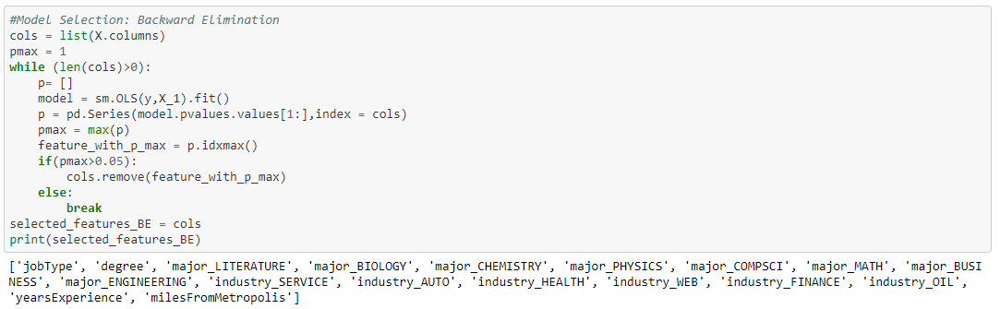
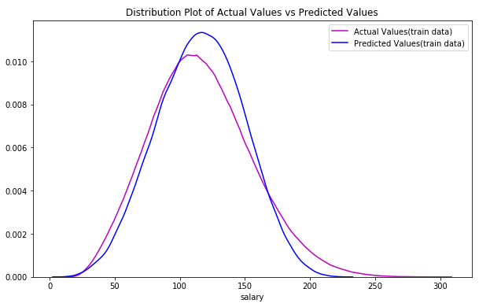
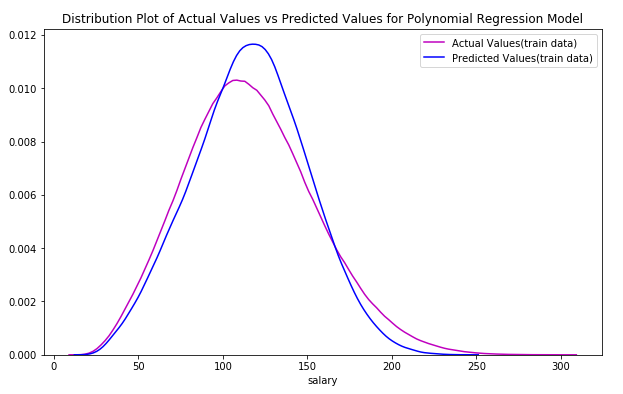

# Salary Prediction Portfolio
Salary Prediction Project
## Table of contents
* [Introduction](#introduction)
* [Technologies](#technologies)
* [Goal](#goal)
* [Dataset](#dataset)
* [Methodology](#methodology)
* [Models Used](#models-used)
* [Model Results and Selection](#model-results-and-selection)
## Introduction
A relatively new company would like to predict employees' annual salary based on specific attributes in order to make competitive job offers to new hires. 
## Technologies
Python
## Goal
The goal for this analysis is to be able to predict the salary for a job position based on certain attributes.
## Dataset
The data includes 1,000,000 observations and the following variables:
 
*jobId:* Unique identifier for each employee 
 
*salary:* fixed payment per year 
 
*companyId:* Identifier for each company 
 
*jobType:* Position held within the company (CEO, CFO, CTO, Vice President, Manager, Janitor, Senior, or Junior) 
 
*degree:* educational degree (Doctoral, Masters, Bachelors, High School, or None) 
 
*major:* concentration of study 
 
*industry:* general field of work 
 
*yearsExperience:* how many years of work experience 
 
*milesFromMetropolis:* how many miles away the job is from a major city

## Methodology
1. *Data Understanding and Data Cleaning:* Lengths and types of the variables were determined and data was checked for missing values and duplicates. Since the dataset contains 1 million records and only five missing values were found, removal was deemed appropriate.  

2. *Exploratory Analysis:* Created visualizations to explore the target variable and examine the potential existance of outliers or corrupt data. Further visualized the relationship between the target and the feature variables and relationships between features.
   
The average salary is approximately $110,000 and salary is normally distributed. The heatmap shows that degree and major are highly correlated.
3. *Feature Selection and Feature Engineering:* Removed features that could potentially create noise and accessed the validity of removal through backward elimination and feature importance. Used ordinal encoding on degree and job type and one-hot encoding on major and industry in order to be used in the model and applied standardization to ensure that one feature doesn't influence the model more than the others.

4. *Model Building and Evaluation:* Established a Baseline Model, using Linear Regreesion, and evaluated based on MSE and R-squared. Developed 3 other models in order to improve upon baseline model.  
 
5. *Scoring the Dataset:* Model with lowest MSE and highest R-squared was selected for salary prediction.The baseline model results were and R-sqaured of 74% and a MSE of 395.
## Models Used
Linear Regression: Baseline
 
Polynomial Transformation: When I plotted the model previously, the data showed some curvature. If we applyed polynomial transformation to the features, a quadratic curve will potentionally fit the data better than a linear one.
 
Ridge Regression: Since the data potentially displays multicollinearity or highly corrleated features, specifically between major and degree, I decided to try this model.
 
Random Forest: Since the data consists of largely categorical features, I choose this model to see if it would perform better.
## Model Results and Selection
**Linear regression with 2nd order polynomial transformation gave the best prediction of salary with MSE of 357 and R-squared of 76%.**
*Ridge Regression also showed MSE of 357, but a R-squared of slightly lower at 73%.
Random Forest resulted in the worse MSE of 372 and R-squared of 75%.* 
 
The distribution plot for the choosen model shows that the predicted values are very close to the actual values with a bit of an overestimation in salaries from $105,000 to $150,000. 
The plot below demostrates the level of importance of each feature on salary. The feature with the highest influence on Salary is job type.
 
