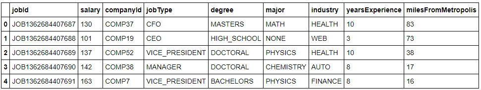

# Salary Prediction Portfolio
Salary Prediction Project
## Table of contents
* [Introduction](#introduction)
* [Technologies](#technologies)
* [Goal](#goal)
* [Dataset](#dataset)
* [Methodology](#methodology)
* [Models Used](#models-used)
## Introduction
A relatively new company would like to predict employees' annual salary based on specific attributes in order to make competitive job offers to new hires. 
## Technologies
Python
## Goal
The goal for this analysis is to be able to predict the salary for a job position based on certain attributes.
## Dataset
The data includes 1,000,000 observations and the following variables:
 
*jobId:* Unique identifier for each employee 
 
*salary:* fixed payment per year 
 
*companyId:* Identifier for each company 
 
*jobType:* Position held within the company (CEO, CFO, CTO, Vice President, Manager, Janitor, Senior, or Junior) 
 
*degree:* educational degree (Doctoral, Masters, Bachelors, High School, or None) 
 
*major:* concentration of study 
 
*industry:* general field of work 
 
*yearsExperience:* how many years of work experience 
 
*milesFromMetropolis:* how many miles away the job is from a major city
## Methodology
1. *Data Understanding and Data Cleaning:* Lengths and types of the variables were determined and data was checked for missing values and duplicates.

2. *Exploratory Analysis:* Created visualizations to explore the target variable and examine the potential existance of outliers or corrupt data. Further visualized the relationship between the target and the feature variables and relationships between features.
3. *Feature Selection and Feature Engineering:* Removed features that could potentially create noise and accessed the validity of removal through backward elimination and feature importance. Used One-hot encoding to encode the categorical data in order to be used in the model.
4. *Model Building and Evaluation:* Established a Baseline Model and evaluated based on MSE and R-sqaured. Developed 3 other models in order to improve upon baseline model
5. *Scoring the Dataset:* Model with lowest MSE and highest R-squared was selected for salary prediction.
## Models Used
Linear Regression
 
Polynomial Transformation
 
Ridge Regression
 
Random Forest
